# Noti-Notjai

## Reproduce

To reproduce environment that we run the code on. You need to create 2 lambda function with API gateway attrached each, 1 SNS topic and an IAM role with proper permission. Steps to do so are shown below.

Login to your AWS acoount.

### Step 1 - Create an SNS topic.

Go to SNS service home page. In Topic section bar on left side, click on it and click create topic--orange button on middle right side of the screen. You will see a screen as below.

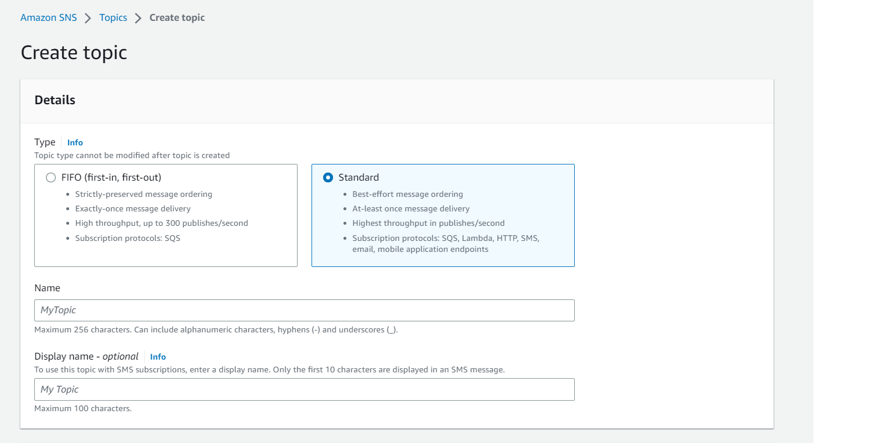

Click on Standard topic option.
Name of this topic as you want. You are need this name later, so make sure you can remember the name. I will name it as 'TopicReproduced'
Leave the rest options as they were.
Click create topic.
You will see the following screen.
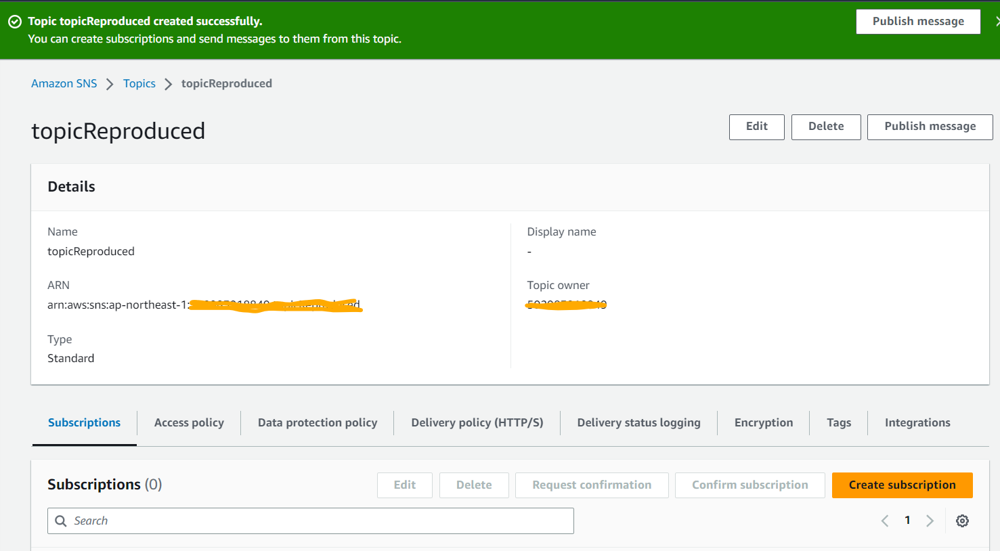

### Step 2 - Create IAM role.

Go to IAM service page.
On the left side on the screen in Access management section. Click on Policies. You will see following page.
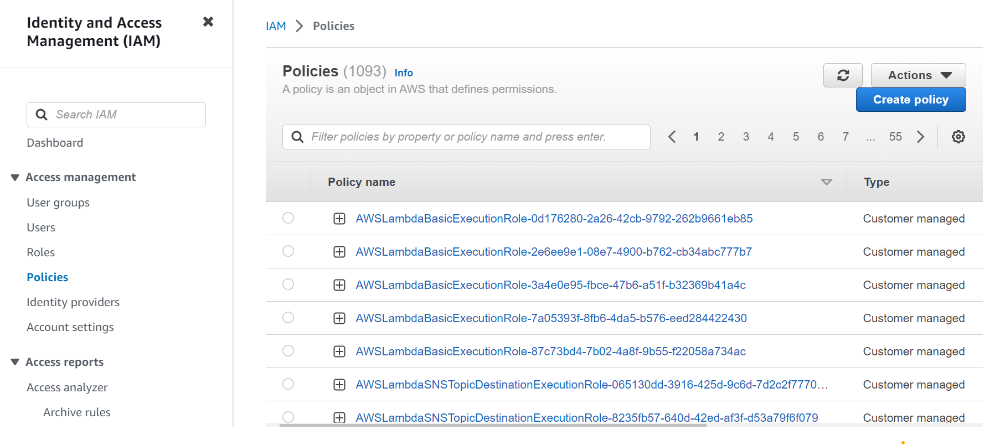
Click on the blue create policy button.
On Policy editor click JSON.
Paste the following JSON to the tab.

```json
{
  "Version": "2012-10-17",
  "Statement": [
    {
      "Sid": "Statement1",
      "Effect": "Allow",
      "Action": [
        "sns:Publish",
        "sns:Subscribe",
        "sns:Unsubscribe",
        "sns:ListSubscriptionsByTopic"
      ],
      "Resource": ["Topic-Arn"]
    }
  ]
}
```

In Resource, change Topic-Arn value to your topic arn. It looks something like "arn:aws:sns:ap-northeast-1:{your-aws-id}:{sns-topic-name}"

Click next.
In Review and create section. Provide a name to your IAM permission because this permission set grant lambda to access SNS that has been create. We should name this permission something like Pub-Sub-List-SNS. I name it as Pub-Sub-Reproduced. After finishing naming the permission, click blue create policy button.

Open IAM service page.
In Access management, select Roles.
You will see a screen like this.
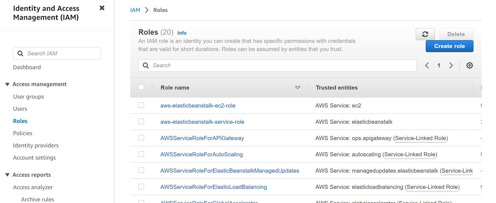
Click on Create role button. You will see the following screen.
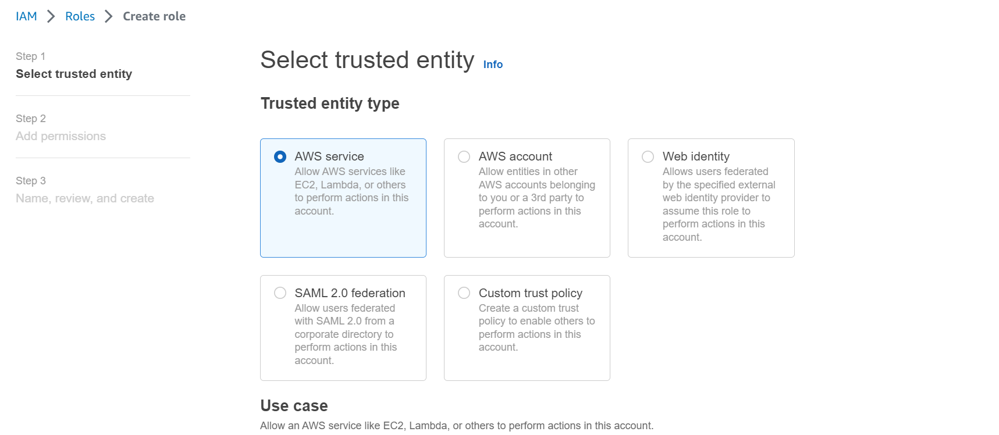
Scroll down to Use case section. Select lambda.
Click Next.
In Add permission page, search policy that you just create in previous step by typing in the permission name in the filter box(in my case it is Pub-Sub-Reproduced). Add it to our role by clicking on empty rectangle. You will get the following UI. 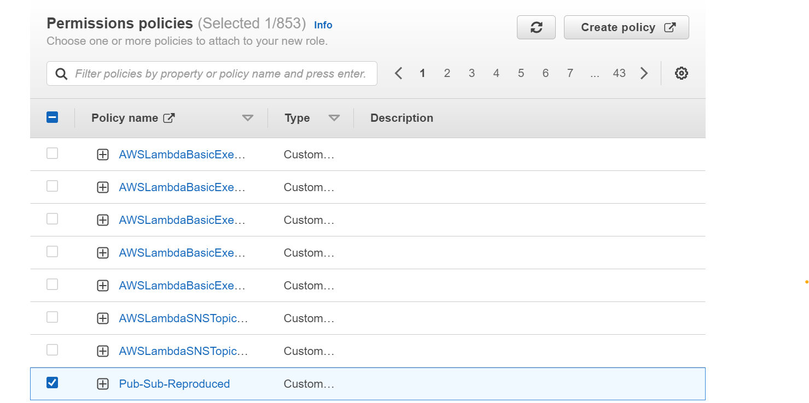
Then, add AWSLambdaExecute permission to your role by searching the name it search box.
After that click on Next button.
In the next screen, give it a name(in my case it is LambdaToPubSubSNS) and make sure that there are 2 permission group in Add permissions section, if not add the missing one to your role.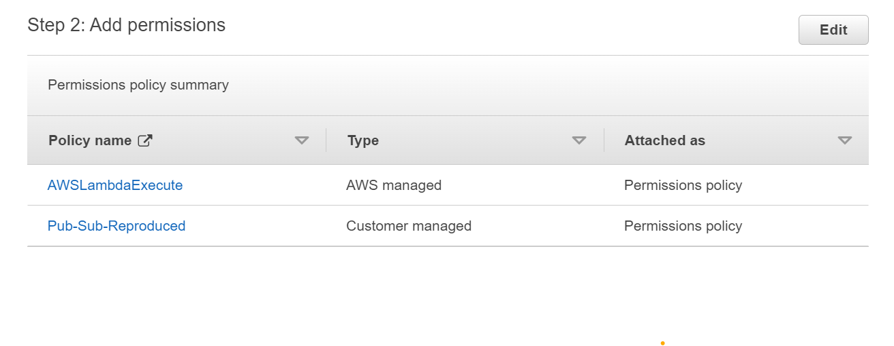
Click Create role. Now we have all necessary permission for the next step.

### Step 3 - Create lambda functions

Go to lambda service page.
Click on the Functions tab. You will see the following page.
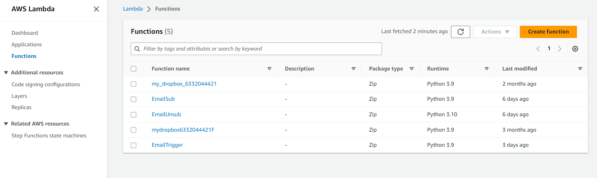
Click on create function.
Click on Author from scratch if not selected.
Provide a meanningful name. Note that this function meant to receive email name from API gateway and subscribe that email to the SNS topic.
A proper name should be like Sub_Email_to_Topic so I name it as Email_Sub_reproduced.
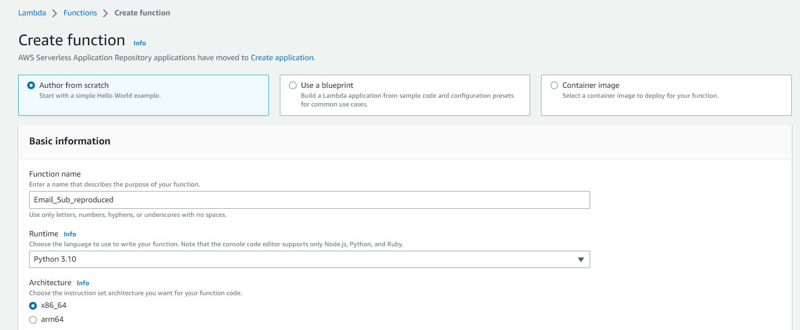
Select runtime as Python.
In the Permissions tab, expand it and click on Use an existing role. And expand the dropdown to select the role that you just create eg. LambdaToPubSubSNS. 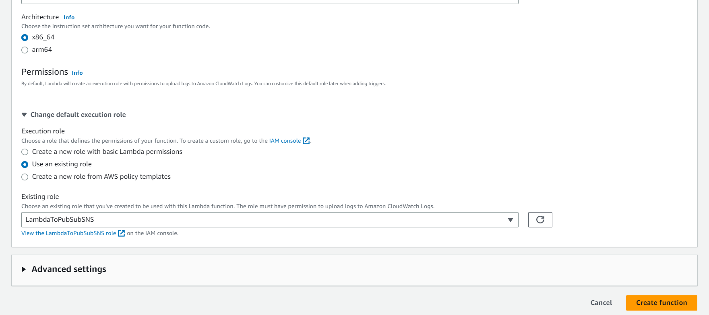
Then, click on Create function.
In Configuration tab below. Click on it. You will see the following screen. 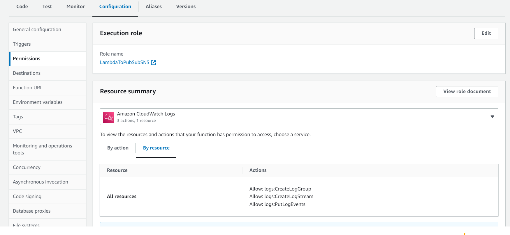. Click on Environment variables. Click on Edit. We add topic arn to this envirionment so click Add environment variable. The key is "topic_arn", the value is your SNS topic arn.
In code section, replace the give code with the code in [subscribe_lambda_function.py](./subscribe_lambda_function.py). Don't forget to click Deploy.

Go to lambda service page.
Click on the Functions tab. You will see the following page.

Click on create function.
Click on Author from scratch if not selected.
Provide a meanningful name. Note that this function meant to receive email name from API gateway and unsubscribe that email from the SNS topic. A proper name should be like Unsub_Email_to_Topic so I name it as Email_Unsub_reproduced.
Select runtime as Python.
In the Permissions tab, expand it and click on Use an existing role. And expand the dropdown to select the role that you just create eg. LambdaToPubSubSNS. 
Then, click on Create function.
In Configuration tab below. Click on it. You will see the following screen. . Click on Environment variables. Click on Edit. We add topic arn to this envirionment so click Add environment variable. The key is "topic_arn", the value is your SNS topic arn.
In code section, replace the give code with the code in [unsubscribe_lambda_function.py](./subscribe_lambda_function.py). Don't forget to click Deploy.

### Step 4 - Create API Gateway

Go to API gateway service page.
Click create API. Select HTTP API to build.
You will see the following screen. 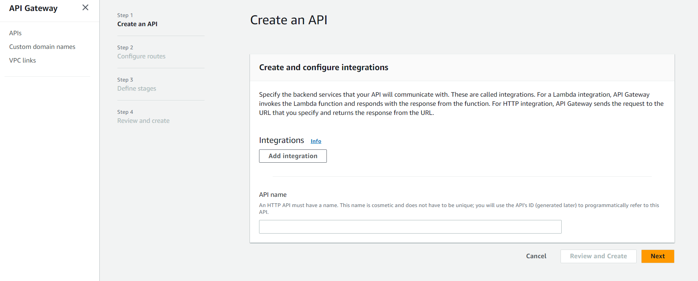. In Integrations, click Add integration. Select lambda from the dropdown. It will ask a lambda name because we will make this api to receive post request to subscribe from client program, we must select the subscribe function name(in my case it is arn:aws:lambda:ap-northeast-1:{my-number}:function:Email_Unsub_Reproduced).
Next, provide a arbitary name to this endpoint in my case I provide it with its funtionality such as Sub_endpoint. 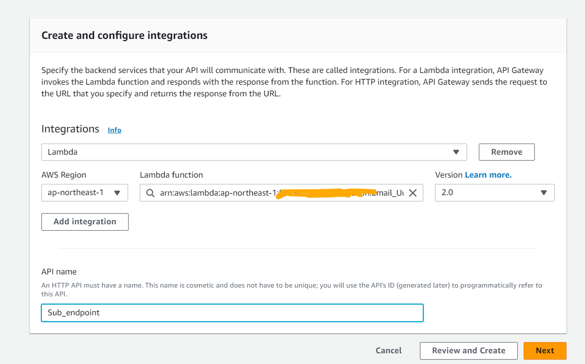. Click Next. You can add route to this api endpoint, we recomment to use the path as /subscribe. 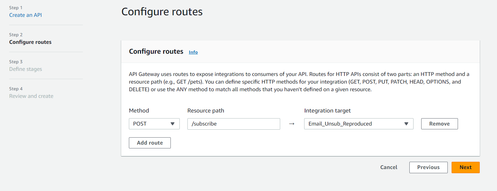 Click Next until Review and create page.
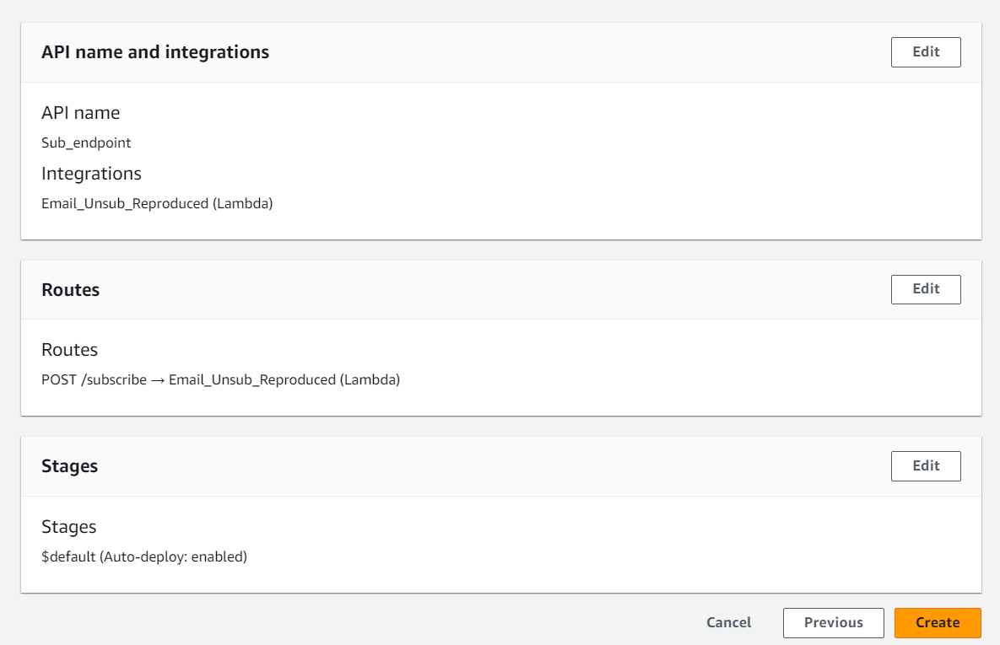 Click Create.

Do the same to unsub. However, change the lambda function to attrach to unsubscribe function name and change the path to /unsubscribe.

### Step 5 - Change Endpoint in client.

Open [function.py](functions.py) file in an editor. Edit variable `SUBSCRIBE_ENDPOINT` and `UNSUBSCRIBE_ENDPOINT` to your endpoint which can be found in invoke API in Details tab of your endpoint. 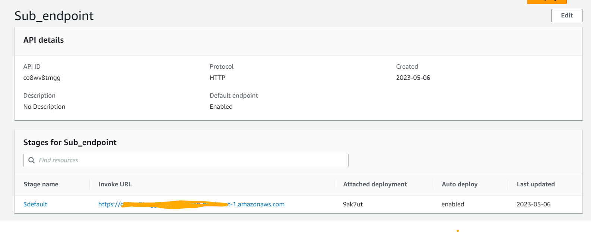
Add the route name at the end of the endpoint eg. if you name as we recommented you will add `/subscribe` and `/unsubscribe` to the end of the string.

### Step 6 - Create CRON job

Go to lambda service page.
Click on the Functions tab. You will see the following page.

Click on create function.
Click on Author from scratch if not selected.
Enter a name. Note that this function meant to produce a message at every interval set by you. So the name could be MessagePublisher but you can name it differently. Select runtime as Python. Select permission as in Step 3(use exiting role). Click create function. Paste code in [trigger_lambda_function.py](./trigger_lambda_function.py) to lambda code. Add topic arn to this envirionment so click Add environment variable. The key is "topic_arn", the value is your SNS topic arn. Click Deploy. In Function overview tab, click Add trigger. Select source as EventBridge. You can create a rule to publish message at different interval. In this case we create a rule name "PushEvery14O" to push every day at 14.00 pm. So we click Create rule, provide our role name, in Rule type select Schedule expression key in cron(0 14 ? \* \* \*).

### Step 7 - Test the System

Run client to see if you can sub/unsub an email. If you get Something went wrong exception, contract me at tiwyy13@gmail.com

## Thank you
